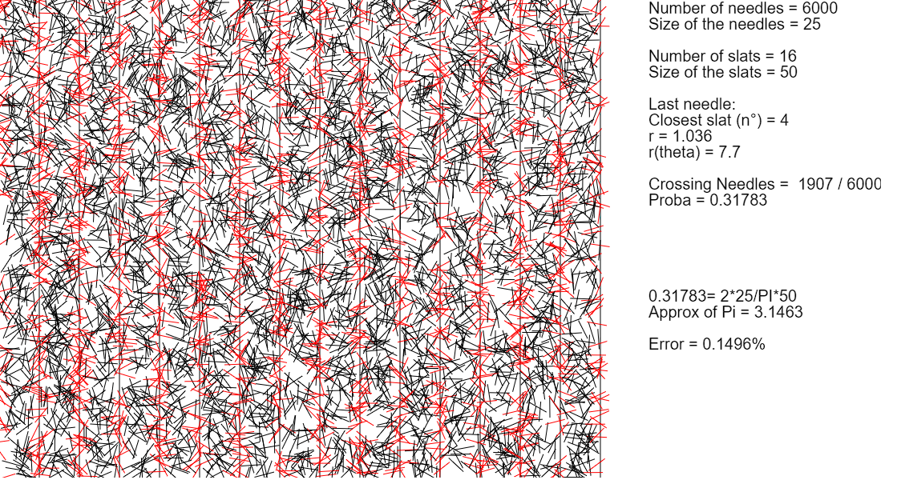
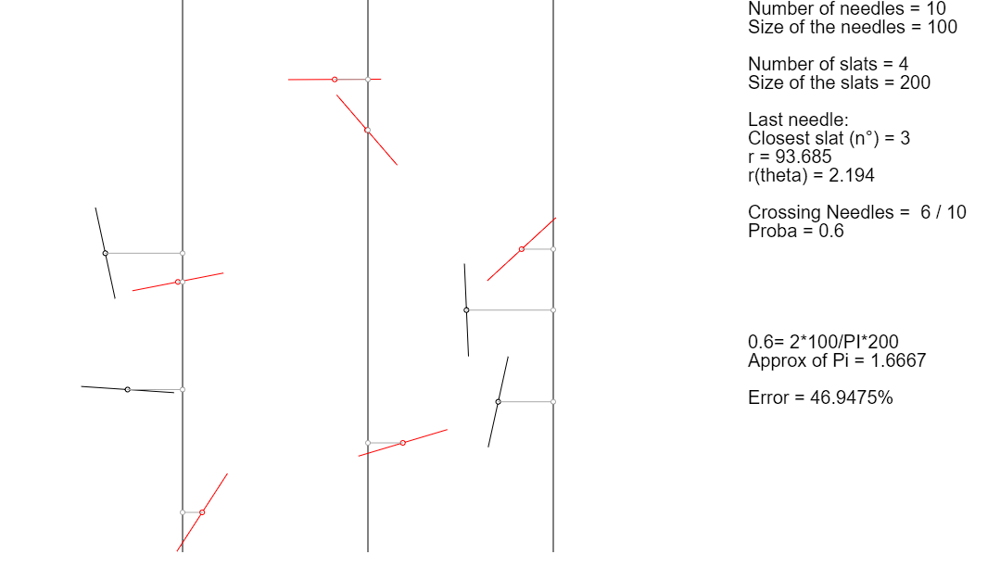

# Buffon's needle

Simple modelisation of the Buffon's needle problem in order to approximate the number Pi, using the Monte Carlo method.

Approximation of Pi


Debug mode


You have to start a local server to test the program. Use the following python command in your local dir:
```python
python3 -m http.server 8080
```

and connect in your web browser to the local ip adress:
```
localhost:8080
```

You can changes the variables of the program in the sketch.js file.

